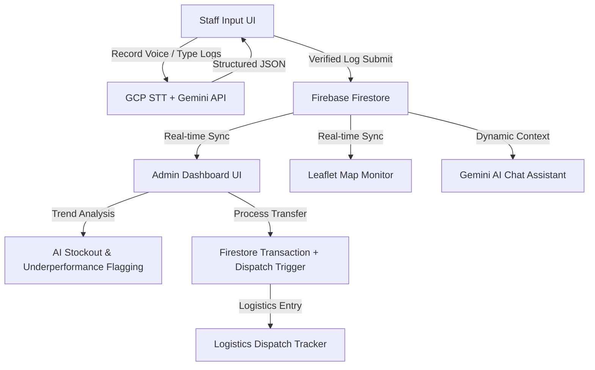

# GroundTruth 🩺📦

> **Build with AI: Code for Communities Hackathon**
>
> 🌐 **Live Website**: [groundtruth-health.web.app](https://groundtruth-health.web.app/)  
> 💻 **GitHub Repository**: [github.com/abi131205/groundtruth](https://github.com/abi131205/groundtruth)

---

## 👥 Team Information
*   **Team Name**: GroundTruth
*   **Team Members**: Abijith, Mayuri, Sneha, Hari

---

## 📌 Project Overview
**GroundTruth** is an AI-driven, real-time resource management and peer-to-peer supply chain redistribution platform designed for Indian Primary Health Centers (PHCs) and Community Health Centers (CHCs). 

By bridging the operational gap between remote village clinics and district health offices, the platform digitizes daily reporting, predicts essential medicine stockouts, flags staff absenteeism or bed strain, and automates supply rebalancing using atomic transactional transfers.

---

## 🚀 Key Features

### 1. 🎙️ Low-Literacy Multilingual Voice Logger
*   Allows rural clinic staff to dictate daily operational reports (patients, bed occupancy, doctor shifts, and inventory) in **English, Hindi, or Tamil**.
*   Utilizes **Google Cloud Speech-to-Text** (with local browser Web Speech API fallback) for transcription.
*   Uses **Gemini** to translate, clean, and map free-speech text (including Hinglish and colloquial terms like "goli" or "dava") into structured database fields.

### 🗺️ 2. Geographic Health Monitor (Leaflet Map)
*   Renders an interactive map of India plotting all 8 nationwide health centers at their coordinates.
*   Pins are color-coded in real-time (**Green/Amber/Red**) based on operational health (stockouts, capacity strain, or staff absence).
*   Allows admins to inspect detailed clinic statistics or jump directly to trend charts on click.

### 📈 3. Predictive AI Stock-Out Warnings
*   Runs mathematical slope analysis on 21-day inventory histories to forecast the exact number of days remaining before critical stock depletion.
*   Calls Gemini on-demand to write custom, natural-language operational explanations for the warning.

### 🔄 4. Peer-to-Peer AI Stock Redistribution
*   Automatically matches deficit facilities with nearby surplus centers containing safe reserves.
*   Suggests the optimal transfer quantity and uses Gemini to write clinical reasoning.
*   Executes peer-to-peer stock movements in a single click using **atomic Firestore transactions**.

### 📦 5. Logistics Dispatch & Transit Pipeline
*   Approved transfers are dispatched into a logistics pipeline tracking shipments (*Dispatched ➜ In Transit ➜ Delivered*).
*   Simulates shipping time progress and provides reception actions for target clinics to automatically absorb the stock.

### 💬 6. AI District Health Assistant
*   A floating chat assistant equipped with **Gemini**.
*   It serializes the live state of all clinics and passes it as prompt context. Admins can ask questions (e.g. *"Who is absent at Sopore CHC?"*) and get immediate data-driven answers.

---

## 🛠️ Technologies Used
*   **Frontend**: React (Vite), JavaScript, Vanilla CSS, Recharts (Data Visualizations), Lucide React (Icons)
*   **Geospatial**: Leaflet Map API (CDN Voyager tiles)
*   **Database**: Google Cloud Firestore (Live real-time sync & atomic transactions)
*   **AI Services**: Google Gemini API (REST client with automatic endpoint failover & key-trimming), Google Cloud Speech-to-Text API

---

## 🔒 Safe Evaluator Configuration (Demo Mode)
To keep developer credentials secure from public exposure:
1.  The app runs in **Local Demo Mode** by default. All charts, maps, and AI suggestions function out-of-the-box using simulated local storage data.
2.  Evaluators can test **live voice transcription and AI text parsing** by opening the **Developer Config** tab in the sidebar and entering their own GCP and Gemini API keys securely in the browser.
